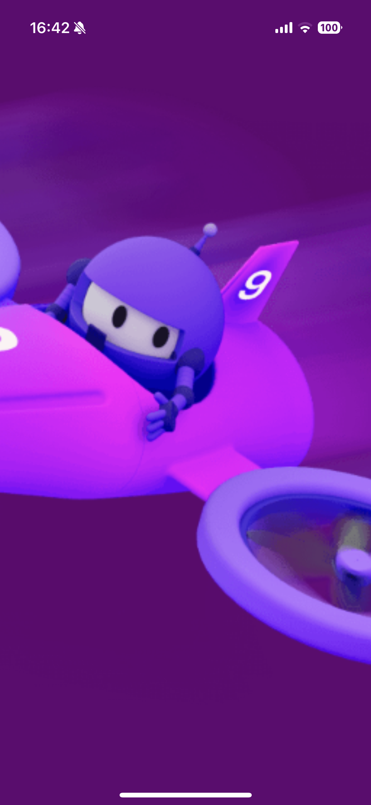
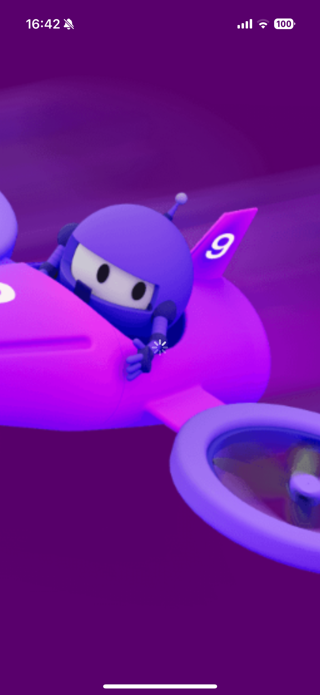

# SuperSplash
Maui proof of concept with native splash, dummy splash loading transition

| Native Splash                                       | Dummy Splash                                       |
| --------------------------------------------------- | -------------------------------------------------- |
|  |  |

See the [demo video](assets/demo.MP4) to see the transition between the native & dummy splash pages!

## Add Native Splash

- In Xcode Create a LaunchScreen.storyboard file

- Format the file accordingly (we will add images later)

- In your maui csproj, disable the generated splash screen for ios
  ```xml
  <MauiSplashScreen Include="Resources\Splash\splash.svg" Color="#512BD4" BaseSize="128,128" Condition="$([MSBuild]::GetTargetPlatformIdentifier('$(TargetFramework)')) != 'ios'"/>
  ```

- Add the launch screen to your resources folder

  > This can be anywhere, but it cannot be at the root level of the iOS platform folder

  ```xml
  <ItemGroup Condition="$([MSBuild]::GetTargetPlatformIdentifier('$(TargetFramework)')) == 'ios'">
          <InterfaceDefinition Include="Resources\LaunchScreen.storyboard"/>
      </ItemGroup>
  ```

- Add to your info.plist (`Platforms/iOS/info.plist`):

  ```xml
  <key>UILaunchStoryboardName</key>
  <string>LaunchScreen</string>
  ```

When you run your app this will now use the native splash.

> Note: On a simulator this will not be displayed unless the app has been signed, a wildcard provisioning profile wasn't enoug for me. This only works on apps that I have generated an explicit provision profile for.

## Add An Image

To work with images is quite easy. When maui generates our app images, it creates an assets catalog so all we need to do is:

- Add a `UIImageView` to the splash screen in xcode
- Position this view according to your needs
- Set the image equal to the filename of the image asset, without the extension ie `dotnet_bot`


## Add A Native Color

We need to create a new assets catalog in order for the native launch screen to be able to use native colours, ie theme aware colours.

- In Xcode create a new asset catalog

- Add new `Color Set`

- Name and configure the colour accordingly

- Copy the `Assets.xcassets` folder into your maui project: `Platforms/iOS/Resources/`

- If you have added it to the resource folder, it will automatically have a `BundleResource` link. If you moved it to another folder you will need to add a bundle resource:
  ```xml
  <BundleResource Include="Platforms\iOS\MyCustomFolder\Assets.xcassets\**\*" />
  ```

- In your splash screen:

- Add to the `<resources>`:
  ```xml
  <namedColor name="SplashBackground">
      <color red="0.32899999618530273" green="0.32400000095367432" blue="0.4779999852180481" alpha="0.33000001311302185" colorSpace="custom" customColorSpace="sRGB"/>
  </namedColor>
  ```

  - And set your view controllers background:

    ```xml
    <color key="backgroundColor" name="SplashBackground"/>
    ```

  When you run the app, the launchscreen should use the configured colour. It will respond to light and dark mode on your device!
